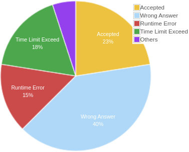

# coding-challenges

My own solutions to various coding challenges from websites such as HackerRank, LeetCode, Exercism, etc.

## Exercism

Exercism is targeted at people with some programming experience (or total beginners) who want to deepen their knowledge or learn new languages. The platform provides thousands of exercises spread across over 50 language tracks, and offer both automated and human mentoring (mentorship is great!).

Exercism is 100% free. It is entirely open source and relies on the contributions of thousands of volunteers. The platform is designed to be fun and friendly, and the authors place a strong emphasis on empathetic communication.

###### Pros

- There are many interesting problems on topics from different fields of science.
- Besides, there are many tracks for learning various programming languages. There are plenty of them! I even found "Emacs Lisp" I want to learn!

###### Cons

- If the track is oversubscribed, you can't program in the Mentored Mode. For example, C track.
- Achievements would be a great addition, because I can't understand what I should add to the paragraph below.

###### Achievements

Accepted  submissions from Practice Mode:

- C: 1 / 66.
- Java: 2 / 109. 

Approved submissions by mentor from Mentored Mode: 

- ...

## HackerRank

HackerRank focuses on computer science topics so it provides challenges for several domains such as Algorithms, Mathematics, SQL, Functional Programming, AI, and more. You can solve all the challenge directly online (see example). They provide a discussion and leaderboard for every challenge, and most challenges come with an editorial that explains more about the challenge and how to approach it to come up with a solution.

Also, Interview Preparation Kit was recently added.

###### Pros

- There are many interesting problems on the "Mathematics" topic.
- Tutorials are useful.

###### Cons

- Problem statements on HackerRank have very detailed descriptions. Imagine an easy task that should be solved in two minutes, and you read its description in 5-10 minutes.
- You need to unlock additional test cases.
- Not all test cases can be used. There is a limit on the size of the test case you want to run. So, you unlock the test case, spend hackos, and you can't use it :)
- Competitions are too rare.

###### Achievements

- Problem solving badge (silver level):

## LeetCode

LeetCode has a collection of some of the best algorithm challenges online today. The topics they cover require knowledge of data structures such as binary trees, heaps, linked lists, etc., which is why their challenges are a bit more advanced than some other websites — but the challenges are great if used when preparing for a software engineering interview.

They also have a Mock Interview section that is specifically for job interview preparation, they host their own coding contests, and they have a section for articles to help you better understand certain problems.

###### Pros

- There are many interesting problems on the "Algorithms and Data Structures" topic.
- Contests are interesting and not uncommon.

###### Cons

- All submissions you submit are added to your statistics in the profile which might be viewed by various people. So, in order to save your statistics, you should be careful with your submissions, test them carefully, and create your own test cases. This is not very, but can provide an additional challenge.
- Some tutorial solutions are too complicated — you can solve some of the problems in a simple way. 

###### Achievements

- Ranking: :star:
- Points:  280.
- Finished contests: 1.
- Solved Question: 9 / 1246.
- Accepted Submission: 18 / 80.
- Acceptance Rate: 22.5 % (18 vs. 62).

---

> Add Codewars and TopCoder later.

> Codewars provides a large collection of coding challenges submitted and edited by their own community. You can solve the challenges directly online in their editor using one of 20+ programming languages. You can view a discussion for each challenges as well as user solutions. You can earn points and climb the rankings by solving their challenges.

> TopCoder is one of the original platforms for competitive programming online. It provides a list of algorithmic challenges from the past that you can complete on your own directly online using their code editor. Their popular Single Round Matches are offered a few times per month at a specific time where you compete against others to solve challenges. Here are some topics that their challenges may cover.
Aside from solving challenges for fun online, they offer sponsored competitions where you can win prizes for writing the best solution.

## References

1. [The 10 Best Coding Challenge Websites for 2018](https://medium.com/coderbyte/the-10-best-coding-challenge-websites-for-2018-12b57645b654)
2. [10 самых популярных сайтов для соревнований программистов на начало 2018 года — russian translation](https://habr.com/ru/company/cloud4y/blog/346838/)
